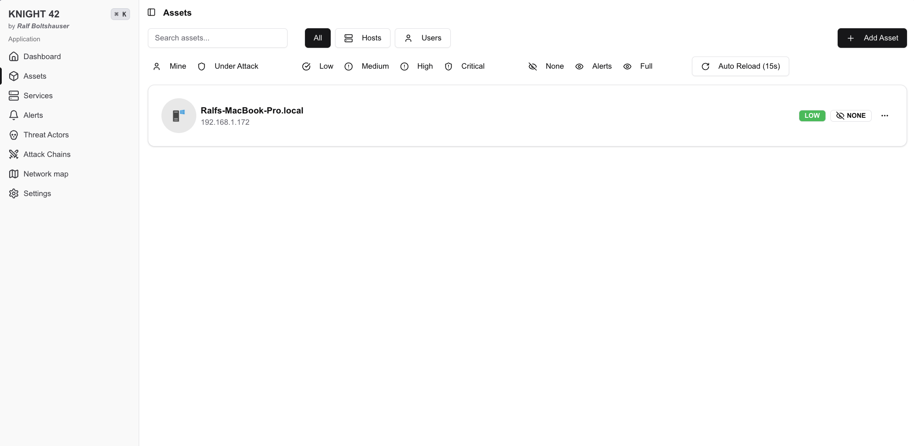

<p align="center">
  
  
  
  
  
</p>

# Knight 42

**Knowledge Network for Incident Gathering, Hosts, and Tracking**

A cybersecurity incident management and threat intelligence platform built for security operations centers, incident response teams, and threat analysts. Knight 42 brings asset inventory, alert triage, attack chain analysis, and response coordination into a single, cohesive interface.

<p align="center">
  
</p>

---

## Features

### Dashboard & Kanban Workflow
Triage alerts, track response actions, and manage reports through drag-and-drop Kanban boards. Keyboard shortcuts (`Tab` / `Shift+Tab`) let you switch contexts without lifting your hands.

### Asset Inventory
Track every asset in your environment — workstations, servers, containers, firewalls, routers, DNS servers. Assign criticality levels, map assets to networks, monitor uptime, and link them to the analysts responsible.

### Alert & Incident Management
Full alert lifecycle from `BACKLOG` through `INITIAL_INVESTIGATION` and `ESCALATED` to `RESOLVED`. Attach IOCs (100+ indicator types), map MITRE ATT&CK techniques, and track national/international reporting status.

### Attack Chain Visualization
Build and visualize attack chains linking alerts, threat actors, and MITRE ATT&CK TTPs. Understand the full kill chain at a glance.

### Threat Actor Profiles
Document threat actors with associated techniques, attack chains, and indicators of compromise.

### Interactive Network Map
Visualize your network topology with hierarchical network definitions, color-coded segments, and asset placement using React Flow.

### Service Dependency Mapping
Map mission-critical services, their components, hosting relationships, and dependency groups with AND/OR operators.

### MISP Integration
Create MISP events directly from alerts, push IOCs to your threat intelligence platform, and maintain bidirectional links.

### MITRE ATT&CK Framework
Pre-seeded technique database. Map techniques to alerts, threat actors, and attack chains throughout the platform.

### Observability
Built-in Prisma metrics dashboard with database performance counters, gauges, histograms, and query monitoring. Jaeger integration for distributed tracing via OpenTelemetry.

### SSH Session Tracking
Track analyst SSH sessions — who connected to which host, when, and for how long. Automatically creates timeline events for investigations.

---

## Quick Start

One-shot setup for a fresh Ubuntu 22.04 server:

```bash
apt update && apt install -y curl && \
curl -sSL https://raw.githubusercontent.com/ralf-boltshauser/knight-42/refs/heads/main/setup.sh | bash
```

---

## Manual Setup

### Prerequisites

- Node.js 22 LTS
- pnpm
- Docker & Docker Compose

### Install Dependencies (Ubuntu 22.04)

```bash
sudo apt update
sudo apt install -y curl docker.io git

# Docker Compose
sudo curl -L "https://github.com/docker/compose/releases/download/1.29.2/docker-compose-$(uname -s)-$(uname -m)" \
  -o /usr/local/bin/docker-compose
sudo chmod +x /usr/local/bin/docker-compose

# Node.js via nvm
curl -o- https://raw.githubusercontent.com/nvm-sh/nvm/v0.40.0/install.sh | bash
source ~/.bashrc
nvm install 22

# pnpm
npm install -g pnpm
```

### Clone & Install

```bash
git clone https://github.com/ralf-boltshauser/knight-42.git
cd knight-42
pnpm install
```

### Configure Environment

Copy `.env.example` (or create `.env`) and set:

| Variable | Description |
|---|---|
| `DATABASE_URL` | PostgreSQL connection string |
| `NEXTAUTH_SECRET` | Secret for NextAuth.js session signing |
| `NEXTAUTH_URL` | Public URL of the application |
| `MISP_API_URL` | MISP instance URL |
| `MISP_API_KEY` | MISP API key |

### Start Services

```bash
bash start.sh
```

This builds the Docker images (Next.js app, PostgreSQL 15, Jaeger), runs database migrations, seeds the MITRE ATT&CK technique database, and starts everything on port **4200**.

---

## Agents

Knight 42 ships with lightweight agents to auto-discover and monitor your infrastructure.

### Linux Agent

```bash
curl -sSL https://raw.githubusercontent.com/ralf-boltshauser/knight-42/refs/heads/main/agents/linux-agent.sh \
  | bash -s -- -h <SERVER_IP>
```

### Windows Agent

```powershell
Set-ExecutionPolicy Bypass -Scope Process -Force
Invoke-WebRequest -Uri https://raw.githubusercontent.com/ralf-boltshauser/knight-42/refs/heads/main/agents/windows-agent.ps1 `
  -OutFile windows-agent.ps1
.\windows-agent.ps1 -TargetIP <SERVER_IP>
```

### Network Scanner

Scans a subnet with nmap, detects OS and services, and pushes discovered assets to the API.

```bash
cd network-scan
python3 -m venv venv && source venv/bin/activate
pip install -r requirements.txt
python3 network-scan.py -t 192.168.0.1/24 -s <SERVER_IP>
```

### Uptime Checker

Periodically pings all registered assets and updates their status.

```bash
cd network-scan
python3 -m venv venv && source venv/bin/activate
pip install -r requirements.txt
python3 uptime-checker.py -s <SERVER_IP>
```

---

## Tech Stack

| Layer | Technology |
|---|---|
| Framework | Next.js 14 (App Router) |
| Language | TypeScript |
| Database | PostgreSQL 15 |
| ORM | Prisma 6 |
| Auth | NextAuth.js |
| UI | Tailwind CSS, Radix UI, shadcn/ui |
| Visualization | React Flow, Framer Motion |
| State | TanStack Query, nuqs |
| Validation | Zod |
| Observability | OpenTelemetry, Jaeger |
| Infrastructure | Docker Compose |

---

## Architecture

```
knight-42/
├── src/app/                 # Next.js App Router pages & API routes
│   ├── (signedIn)/          # Authenticated routes
│   │   ├── alerts/          # Alert management
│   │   ├── assets/          # Asset inventory
│   │   ├── attack-chains/   # Attack chain builder
│   │   ├── network-map/     # Network topology
│   │   ├── observability/   # Metrics dashboard
│   │   ├── services/        # Service dependencies
│   │   ├── settings/        # Configuration
│   │   └── threat-actors/   # Threat actor profiles
│   └── auth/                # Authentication
├── prisma/                  # Schema & seed data (MITRE ATT&CK)
├── agents/                  # Linux & Windows host agents
├── network-scan/            # Python network scanner & uptime checker
└── compose.yaml             # Docker Compose stack
```

---

## Credits

- **Nicolas Caluori** — Uptime checker
- **Bamuel Saumgartner & Simon Schmandt** — MITRE ATT&CK technique seed data
